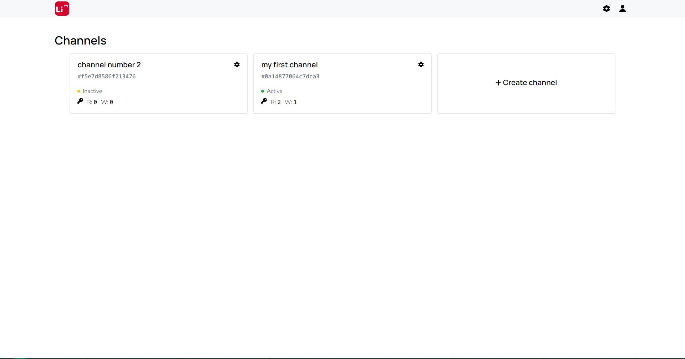
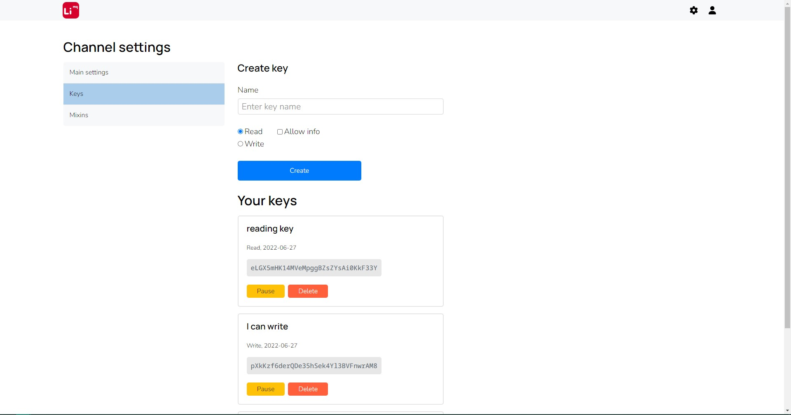

# [LiMQ](https://github.com/emmitrin/limq) panel

[Версия на русском](README.ru.md)

LiMQ is powerful message broker.

С помощью данной панели можно осуществлять следующие действия:
* Регистрироваться в системе
* Управлять каналами
* Создавать ключи
* Управлять миксинами

## Установка
Для работы панели необходимо: 
1. Установить все зависимости из [`requeriments.txt`](requirements.txt)
2. Установить [Redis](https://redis.io/) 
3. Установить [PostgreSQL](https://www.postgresql.org/)
4. Выполнить команды из файла [`init.sql`](storage/init.sql) 
   внутри [терминала](https://www.postgresql.org/docs/current/app-psql.html) PostgreSQL
5. Настроить переменные окружения:

| Название | Описание | Значение по умолчанию |
|----------|----------|-----------------------|
| `secret_key` | Flask [secret key](https://flask.palletsprojects.com/en/2.1.x/config/#SECRET_KEY) | |
| `psql_user` | Имя пользователя PostgreSQL | `limq_front` | 
| `psql_password` | Пароль пользователя PostgreSQL |  |
| `psql_host` | Адрес сервера PostgreSQL | `localhost` | 
| `psql_port` |  Порт сервера PostgreSQL | `5432` |
| `psql_db` | Название базы данных PostgreSQL | `limq` |
| `redis_host` | Адрес сервера redis | `localhost` |
| `redis_port` | Порт сервера redis | `6379` | 
| `redis_db` | id базы данных redis | `3` | 
| `redis_password` | Пароль redis | | 

6. Запустить [`core.py`](core.py), сервер будет использовать `5000` порт

